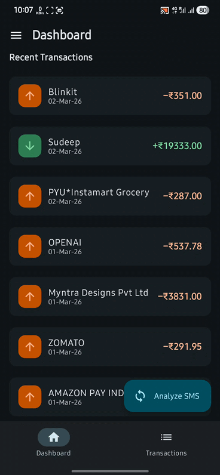
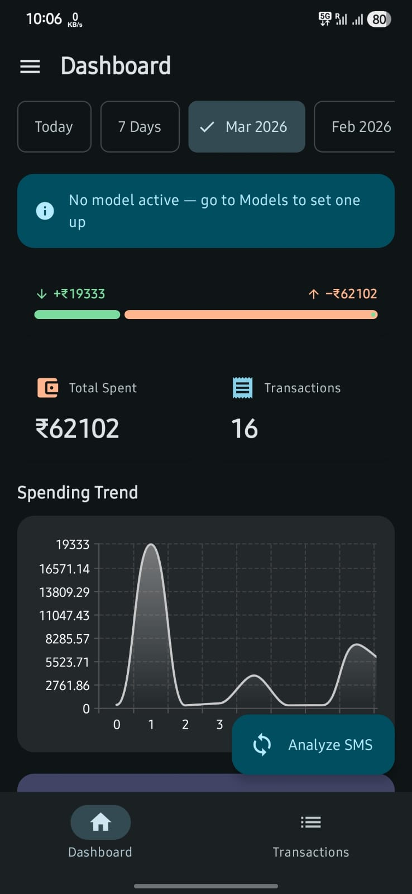
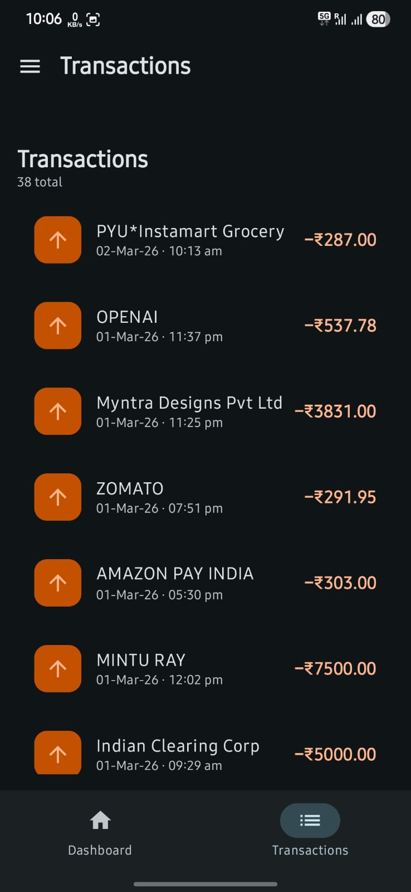
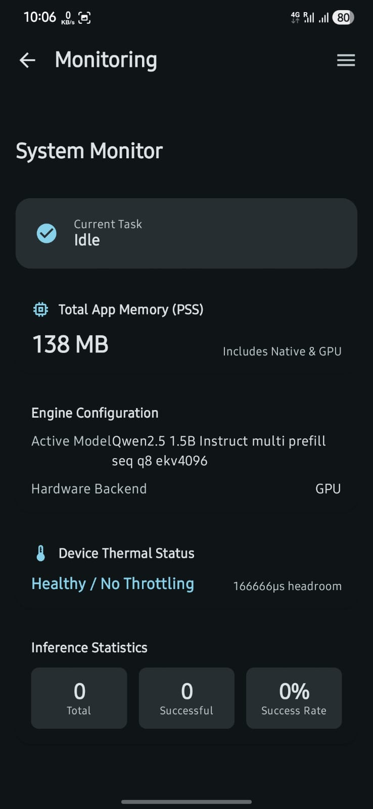

  <h1>🏦 Spend Analyser</h1>
  
<strong>Powered by Gemma & LiteRT AI • 100% On-Device Privacy</strong>

  
  
   
  
  
  
  

---

## 🌟 What is Spend Analyser?

**Spend Analyser** is an intelligent, zero-cloud financial tracker built strictly for Android. Unlike other finance apps that upload your sensitive banking SMS messages to third-party servers, Spend Analyser uses cutting-edge **On-Device Large Language Models (LLMs)** to securely read, extract, and categorize your transactions right in the palm of your hand. 

Your financial data never leaves your device. 

## ✨ Why You'll Love It

### 🧠 100% Offline AI parsing
Harness the power of local Google Gemma and DeepSeek LLMs (via MediaPipe and LiteRT). The app intelligently scans your incoming bank SMS messages and extracts merchants, amounts, and transaction types without an internet connection.

### 📊 Beautiful, Actionable Dashboards

Visualize your money like never before with dynamic **Vico Line Charts**.
* **Cash Flow Health:** Quickly see the split between your income (credits) and expenses (debits).
* **Monthly Trends:** Track your spending habits over time with beautiful native Compose charts.
* **Top Spends:** Instantly know where your money is going with our top destination counters.

 

### 📱 Seamless Transaction Management

Keep a perfectly organized ledger of every coffee, grocery run, and paycheck.
* **Smart History:** Transactions are beautifully listed with clear indicators.
* **Deep Details:** Tap any transaction to instantly view the original raw SMS that generated it.
* **Full Control:** Edit amounts, merchants, or delete false positives with a single tap. 

 

### ⚙️ Ultimate System Transparency

We don't hide the magic. The built-in **System Monitor** lets you see exactly how the AI is performing.
* **Live Native Memory (PSS) Tracking:** Watch the exact RAM footprint of the LLM in real-time.
* **Thermal Health Radar:** See device throttling limits before they happen.
* **Hardware Acceleration:** Toggle between CPU and GPU execution on the fly.

 

### 🔋 Battery-Friendly Background Magic
Using robust Android `WorkManager` queues, the app processes your unread SMS messages silently in the background, carefully respecting your device's battery and thermal constraints.

Want a break? You can pause background polling at any time right from the Navigation Drawer.

 

## 🛠 Built With Modern Android Tech
This project is a showcase of modern Android development best practices:
- **UI:** 100% Jetpack Compose (Material 3)
- **Architecture:** MVVM, Clean Architecture, Kotlin Coroutines & Flows
- **Local AI:** Google AI Edge SDK (`.litertlm`), MediaPipe (`.task`)
- **Persistence:** Room Database, Jetpack DataStore
- **Background:** WorkManager, BroadcastReceivers

## 🚀 Getting Started

1. **Clone the Repository**
2. **Build & Run**: Open in Android Studio and hit Run.
3. **Download a Model**: Open the app, slide open the Navigation Drawer, navigate to **Models**, and download a local LLM to get started!
4. **Grant Permissions**: The app needs `RECEIVE_SMS` and `READ_SMS` to work its magic.

## 📜 License
This built-with-love project is licensed under the [MIT License](LICENSE).

